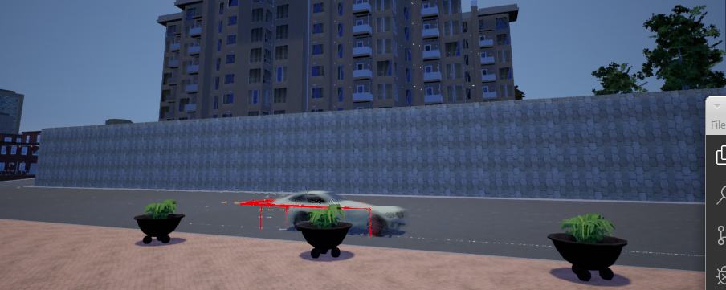

# Projekt 2

This project is currently implemented using Carla-API Version 0.9.6 for Linux. The actually available version for Windows is the Carla API 0.9.5. The changes made in the API 0.9.6 do not allow you to test your code with older API-Version because.

### Problems while using Carla-API

#### Debugging an object
While debugging an object in movement, the box can appear move back to the current position of the object.

