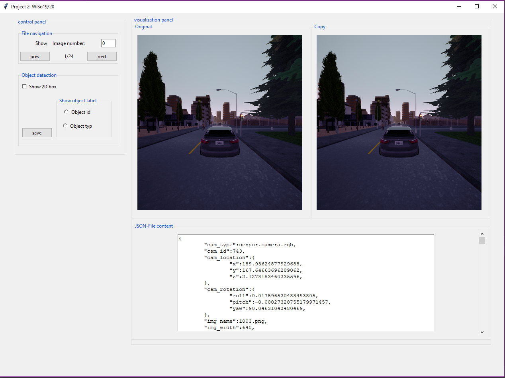

# Projekt 2

This project present CUSANI as a way to use simulators to create a synthetic image-based dataset and it correspon-
ding annotation for computer vision tasks.

# CUSANI

The CUstom Annotation's generator for Identification of vehicles ans pedestrians in synthetically created images
using the CARLA-simulator (CUSANI) is a simple software implemented with Python, that extends the features of the
CARLA-simulator to a synthetic image-based dataset.

## Goal and requirement

The software is implemented to evaluate the perception task in self-driving expecially for the identification
of vehicles and pedestrians in an image using a 2D bounding-box.

#### Debugging an object
While debugging an object in movement, the box can appear move back to the current position of the object.

Tracking an object with its Id occures without (a big) latency as trying to encapsulapte it in a box

App-Interface:

